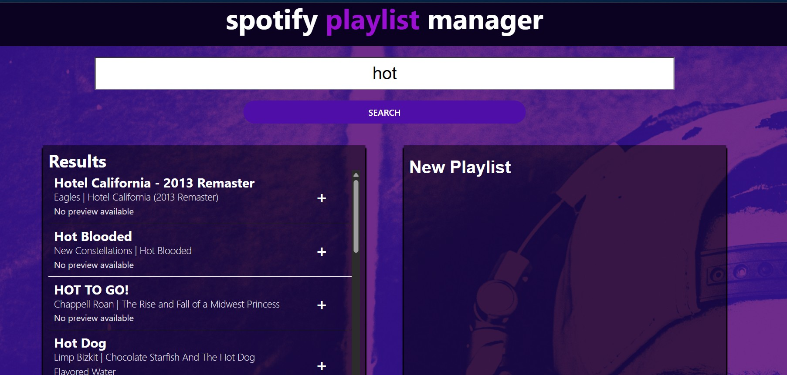

## Spotify Playlist Manager

A React web app to search Spotify tracks, create playlists, and save them locally. Built with Vite and modular React components.

Features

Search Tracks – Search Spotify tracks by song title using the Spotify API.

Add / Remove Songs – Add songs to your playlist or remove them.

Rename Playlist – Give your playlist a custom name.

Save Playlist Locally – Save playlists locally with a progress bar animation.

Manage Saved Playlists – View and delete previously saved playlists.

Duplicate Prevention – Songs already in your playlist are filtered out from search results.

Responsive Layout – Works on desktop; small-screen responsiveness is partially implemented.

⚠️ Note: The "SAVE TO SPOTIFY" button does not actually save playlists to Spotify. Due to recent changes in the Spotify API, handling OAuth access tokens in a frontend-only app is complicated. Playlists are saved locally in the app state for demonstration purposes.

---

## Demo

Setup Instructions
1. Clone the repository
git clone https://github.com/your-username/spotify-playlist-manager.git
cd spotify-playlist-manager

2. Install dependencies
npm install
# or
yarn install

3. Create a .env file

At the project root, create a file named .env and add your Spotify credentials:

VITE_SPOTIFY_CLIENT_ID=your_client_id_here
VITE_SPOTIFY_CLIENT_SECRET=your_client_secret_here

⚠️ Do not commit your .env file – it contains sensitive credentials.
.gitignore already includes .env.

4. Run the app
npm run dev
# or
yarn dev

The app will run at http://localhost:5173 (or the port shown in your terminal).

---

## Project Structure
public/               # Static assets like images
src/
 ├─ components/       # Reusable React components
 ├─ utils/            # Spotify API utility
 ├─ App.jsx           # Main app component
 ├─ App.css           # Global styles
 └─ main.jsx          # Vite entry point
.env                  # Spotify credentials (ignored by git)

## Notes

Small-screen/mobile responsiveness is partially implemented. Some elements may overlap on very narrow screens.

The app uses Spotify’s Client Credentials flow, so your client secret is used in the frontend. For production apps, a backend proxy is recommended to protect secrets.

The "SAVE TO SPOTIFY" button does not connect to Spotify. Playlists are saved locally to demonstrate the workflow.

Future Improvements

Full mobile responsiveness

Drag-and-drop playlist ordering

Audio preview of tracks

Integration with Spotify OAuth to save playlists to a real Spotify account

---

## License

This project is open-source and free to use.